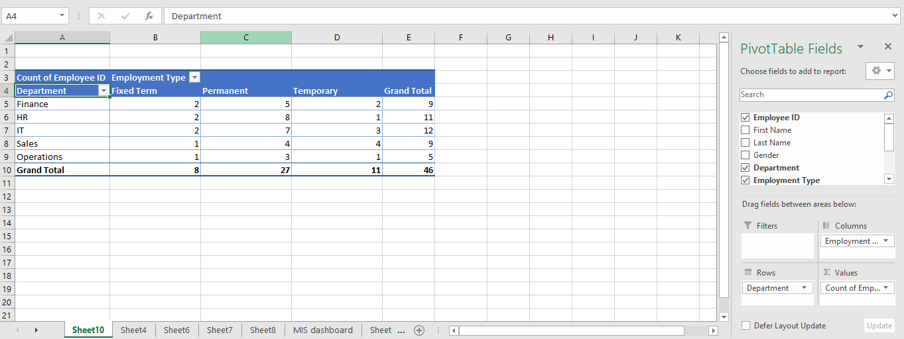

# Employee MIS Automation & Dashboard

An automated Employee MIS reporting dashboard built using Microsoft Excel, Power Query, PivotTables, PivotCharts, Slicers, and VBA.

## Project Overview

This project demonstrates an end-to-end Employee MIS reporting workflow, from raw employee data to an interactive management dashboard.

Power Query is used for data cleaning and transformation, while PivotTables and PivotCharts are used for reporting and visualization.

A VBA-based **Refresh MIS** button automates the workbook refresh process after new employee records are added.

## Tools & Technologies

- Microsoft Excel
- Power Query
- PivotTables
- PivotCharts
- Slicers
- VBA
- Excel Tables
- Data Cleaning
- MIS Reporting

## Dashboard KPIs

- Total Employees
- Permanent Employees
- Female Ratio
- Average Salary

## Dashboard Analysis

- Department Headcount
- Employees by Employment Type
- Average Salary by Department
- Monthly New Joiners

## Interactive Filters

- Department
- Employment Type
- Joining Month

## Automation Workflow

```text
Raw Employee Data
       ↓
Power Query Data Cleaning
       ↓
Cleaned Employee Dataset
       ↓
PivotTables
       ↓
PivotCharts & KPI Cards
       ↓
Interactive Slicers
       ↓
VBA Refresh MIS
       ↓
Updated Dashboard
## Dashboard Preview
```


## Data Cleaning & Automation


## PivotTables & Analysis


